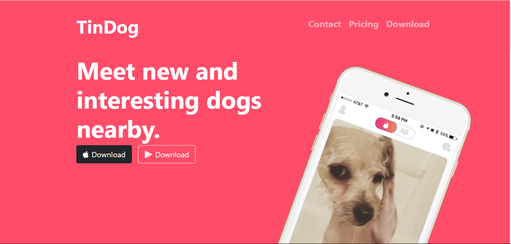

# TinDog

**TinDog** is a responsive website built using Bootstrap, designed to showcase a fictional dating platform for dogs. The site provides an overview of the service, user testimonials, and information about the app's features.

## Table of Contents

- [Demo](#demo)
- [Features](#features)
- [Technologies Used](#technologies-used)
- [Installation](#installation)
- [Usage](#usage)
- [Screenshots](#screenshots)

## Demo

Check out the live demo of the TinDog website [https://tin-dog-website-clone.netlify.app/](https://tin-dog-website-clone.netlify.app/).

## Features

- Responsive design that adapts to various screen sizes (mobile, tablet, desktop).
- Clean and modern user interface.
- Utilizes Bootstrap for styling and layout.
- Includes sections such as About, Testimonials, and Download.

## Technologies Used

- **HTML5**
- **CSS3**
- **Bootstrap 4**: For responsive design and UI components.

## Installation

To clone and run this project locally, you'll need Git installed on your computer.

1. Clone the repository:
    ```bash
    git clone https://github.com/Nikita-developer38/TinDog
    ```

2. Navigate to the project directory:
    ```bash
    cd tindog
    ```

3. Open the `index.html` file in your browser to view the website.

## Usage

You can use this template as a base for your projects, modify the content, and add more features as needed. The site is fully responsive and can be viewed on any device.

## Screenshots


 
